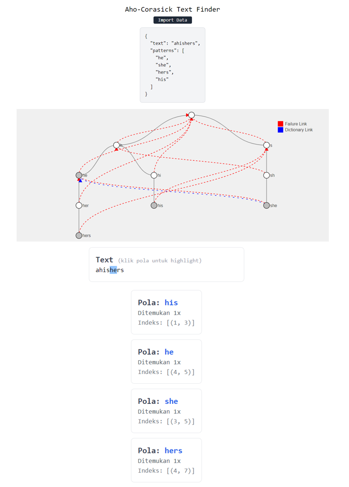

# Aho-Corasick Text Finder
> Task 7 Seleksi Lab IRK - Ahmad Rafi Maliki 13522137

## Deskripsi

Aplikasi ini merupakan pattern finder menggunakan algoritma Aho-Corasick

## Teknologi Yang Digunakan

### Bahasa Pemrograman:
1. HTML
2. CSS
3. JavaScript
   
### Framework:
1. ViteReact
2. TailwindCSS
   
### Deployment:
1. Vercel


## Algoritma

## Cara menjalankan program

Aplikasi dapat diakses langsung pada [https://13522137-ahocorasick.vercel.app/](https://13522137-ahocorasick.vercel.app/) atau

1. Clone project dan install dependency
```
git clone https://github.com/rafimaliki/13522137-AhoCorasick-Seleksi_IRK
cd 13522137-AhoCorasick-Seleksi_IRK/src
npm i
```
2. Jalankan development server
```
npm run dev
```
3. Akses frontend
```
http://localhost:5173/
```

## Cara menggunakan program



Tombol:
1. "Import data"
   Pengguna dapat meng-import struktur papan menggunakan file .json dengan format sebagai berikut
    ```json
     {
       "text": "saya sangat suka matkul irk. saya jadi ingin makan ayam.",
       "patterns": ["saya", "ayam", "aman"]
     }
2. Text Highlighting
   Pengguna dapat meng-klik pola pada list jawaban untuk meng=highlight pola pada teks

## Referensi Belajar

[Aho–Corasick algorithm](https://en.wikipedia.org/wiki/Aho%E2%80%93Corasick_algorithm) <br>
[Niema Moshiri](https://www.youtube.com/watch?v=O7_w001f58c&t=505s)

